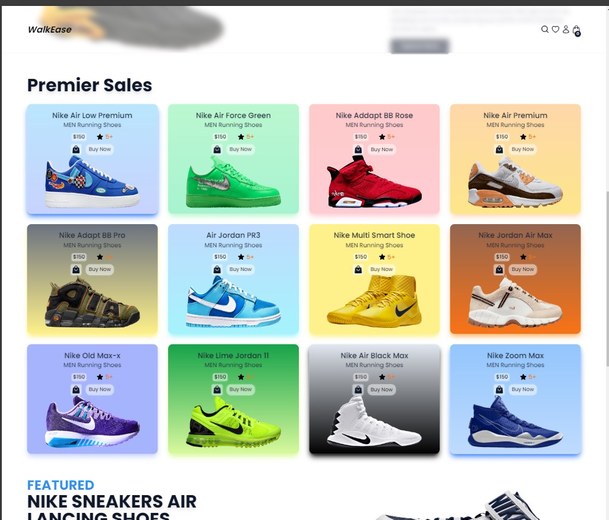

# WalkEase - Shoe Selling E-commerce App

**WalkEase is a modern and stylish shoe selling Ecommerce app designed to provide users with a seamless shopping experience for footwear. With its animated hero section, sticky navbar, hover effects, beautiful UI, and mobile responsiveness, WalkEase offers a visually appealing interface combined with Cart functionality.**

## Features

- Animated Hero Section: Catch the user's attention with an animated hero section that highlights featured products or promotions.
- Sticky Navbar: Ensure easy navigation throughout the app with a sticky navigation bar that remains visible as users scroll.
- Hover Effects: Enhance user interaction with captivating hover effects on product images and buttons.
- Beautiful UI: Enjoy a visually appealing design crafted to engage users and showcase products effectively.
- Mobile Responsiveness: Access the app seamlessly on any device, as it is optimized for mobile responsiveness.
- Cart/Store Functionality: Allow users to add products to their cart, view their selections, and complete purchases effortlessly.

## Technologies Used

1. React
2. Redux Toolkit
3. React Redux
4. Tailwind CSS
5. Vite

## Assets Resources

1. Icon-: [HeroIcons](https://heroicons.com/)
2. Font-: [Google Fonts](https://fonts.google.com/)
3. Images:
   - [purepng](https://purepng.com/)
   - [freepik](https://www.freepik.com/)
   - [pngwing](https://www.pngwing.com/)
4. Slider-: [React Splide](https://splidejs.com/)

## Demo

- [Live Link](https://walk-ease.vercel.app/)

## Screenshots

## License

This project is licensed under the MIT License

[MIT License](LICENSE)

Copyright (c) 2024 hkDev(ho-ssain)
